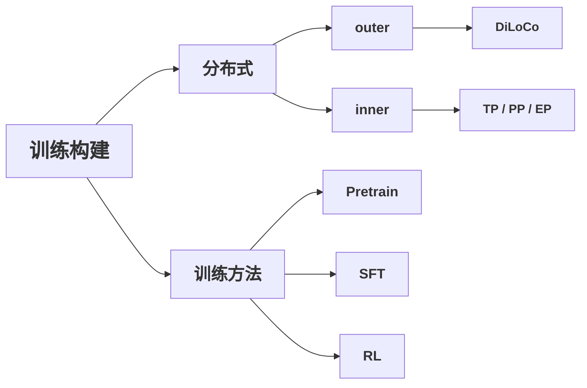

```mermaid
graph LR
    A["训练构建"]

    B["分布式"]

    C["训练方法"]


    B --> B1["outer"]
    B --> B2["inner"]

    B1 --> B11["DiLoCo"]
    B2 --> B12["TP / PP / EP"]


    C --> C1["Pretrain"]
    C --> C2["SFT"]
    C --> C3["RL"]


    A --> B
    A --> C

style A font-size:26px,font-weight:bold
style B font-size:22px,font-weight:bold
style C font-size:22px,font-weight:bold

style B1 font-size:18px,font-weight:bold
style B2 font-size:18px,font-weight:bold
style C1 font-size:18px,font-weight:bold
style C2 font-size:18px,font-weight:bold
style C3 font-size:18px,font-weight:bold

style B11 font-size:16px,font-weight:bold
style B12 font-size:16px,font-weight:bold

```